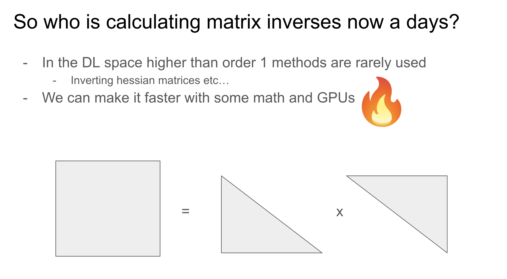

## Tensors and LayoutTensors

A tensor can be defined as a layout and a engine, where the engine is a pointer to the underlying linear data. The layout is then a map from index-space to a offset from the pointer address.

For example, a 2D tensor in pytorch with a row-major format we have the stride is (N, 1) so to access element (i, j) we calculate the dot-product (i,j)*(N, 1)=Ni+j. To confirm our intution we see that varying over dimension i, we jump over N elements (bad cache locality), while to go over a row (dimension j), the memory is contiguous (good cache locality).

So in row-major formats reductions over dimension i are slow, while reductions over dimension j are fast.

